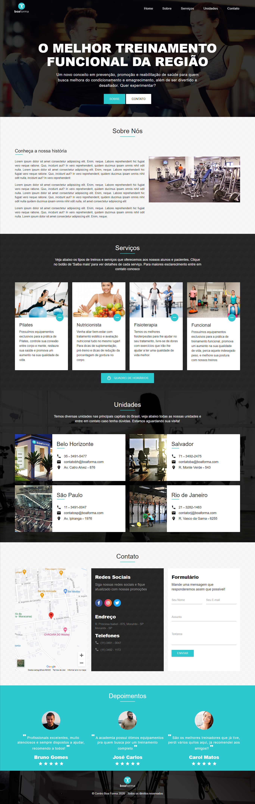
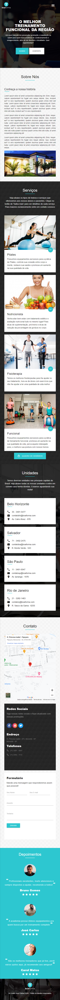

<div align="center">

# Academia Boa Forma

</div>

Esse projeto foi desenvolvido para uma academia, onde o objetivo foi apresentar a história da empresa, mostrar os serviços que ela propociona e fornecer um formulário para contato. Nesse projeto eu utilizo apenas Materialize, CSS3 e PHP. Para deixar o site responsivo eu utilizo o conceito de Mobile First. 

- Demo: [Clique aqui para ver esse projeto](https://leandro-br.github.io/proj-academia/)

## Desktop:
<div align="center">
    
</div>

## Mobile:
<div align="left">
    
</div>


## Tecnologias:
Esse projeto foi desenvolvido com as seguintes tecnologias:

- Materialize CSS
- HTML5
- CSS3 (FLEXBOX)
- JQUERY
- PHP

## Como usar:

```bash
# Clone this repository
$ git clone https://github.com/leandro-br/proj-academia.git
```

## Autor: 
 

#### Leandro Rafael

[](https://www.linkedin.com/in/leandrorafael-dev/) [](https://twitter.com/leandrorafaelBR) 

## Licença:
[](https://opensource.org/licenses/MIT)

Este projeto está sob a licença do MIT. Veja a licença para mais informações:

[Ver Licença](https://github.com/leandro-br/proj-academia/blob/master/LICENSE)
